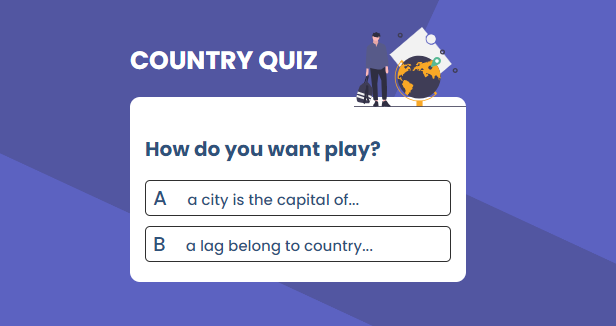

<h1 align="center">Country Quiz</h1>

   <h3>
    <a target="_blank" href="https://github.com/brandongc9911/CountryQuiz">
    Repositorio
    </a>
     | 
    <a target="_blank" href="https://aquamarine-salmiakki-fef436.netlify.app">
      Demo
    </a>
  </h3>

**CountryQuiz** es una aplicacion web que utiliza la API restCountry y las siguientes tecnologias:

* HTML
* JavaScript
* React
* Vite

## Contact
- Website [gcdev](https://gcdev.alwaysdata.net)
- GitHub [@brandongc9911](https://github.com/brandongc9911)
- Linkedin [@brandon-gomez-contreras](https://www.linkedin.com/in/brandon-gomez-contreras-49b709226/)